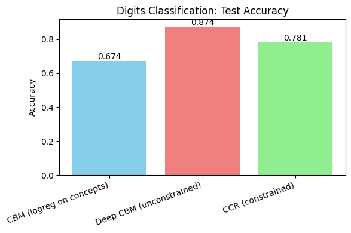
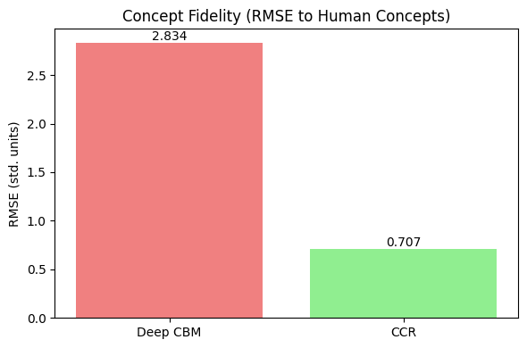
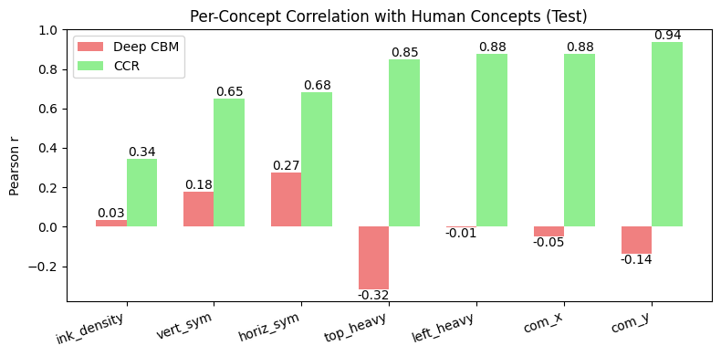

# Constrained Concept Refinement (CCR) Demo

This repository contains a demonstration notebook implementing **Constrained Concept Refinement (CCR)** on the `digits` dataset.  
It illustrates how CCR improves accuracy and interpretability in **Concept Bottleneck Models (CBMs)**.

---

## 📌 Purpose
The demo replicates findings from the paper:  
[*Enhancing Performance of Explainable AI Models with Constrained Concept Refinement (CCR)*](https://arxiv.org/pdf/2502.06775)

It compares three approaches:
1. **Baseline CBM** – Logistic regression on human-defined concepts.  
2. **Deep CBM (Unconstrained)** – Learns concepts end-to-end from pixels, but concepts may drift.  
3. **CCR (Constrained)** – Adds a constraint to align learned concepts with human-defined ones.

---

## 🗂 Dataset & Human Concepts
We use the **sklearn `digits` dataset** (8×8 images of digits 0–9).

Seven human-interpretable concepts are computed:
- **Ink Density** – average pixel intensity  
- **Vertical Symmetry** – left vs right halves  
- **Horizontal Symmetry** – top vs bottom halves  
- **Top-Heavy Ratio** – ink in top vs bottom  
- **Left-Heavy Ratio** – ink in left vs right  
- **Center of Mass (X, Y)** – position of ink mass  

These concepts form the *interpretable bottleneck*.

---

## ⚙️ Models
- **Baseline CBM**: Logistic regression on standardized human concepts.  
- **Deep CBM**: Neural network learns concepts → labels (unconstrained).  
- **CCR**: Same network, but loss includes a penalty to match human concepts:

$$\mathcal{L} = \text{CE}(\hat{y}, y) + \alpha_{CCR} \cdot \text{MSE}(z, h)$$

where `z` = learned concepts, `h` = human concepts.  
The hyperparameter $\alpha_{CCR}$ controls the strength of the alignment constraint: higher values enforce closer matching to human concepts but may slightly reduce classification accuracy if set too high.

---

## 📊 Evaluation Metrics
The notebook measures both **accuracy** and **concept fidelity**:
- **Test Accuracy** – classification performance.  
- **Concept Fidelity** –  
  - RMSE between learned vs human concepts  
  - Per-concept Pearson correlation  

---

## 🔍 Results
- **Baseline CBM**: Interpretable, but lower accuracy.  
- **Deep CBM**: Higher accuracy, but concepts drift away from human meaning.  
- **CCR**: Maintains accuracy **and** enforces alignment with human concepts.  

Visualizations:
- Accuracy comparison bar chart  
  
- Concept fidelity plots (RMSE, correlations)  
    
- Example images with human vs CCR concepts  
  


---

## ✅ Key Takeaways
- **CCR bridges the gap** between accuracy and interpretability.  
- Unlike unconstrained CBMs, CCR ensures **learned concepts remain human-aligned**.  
- The notebook confirms the paper’s central thesis:  
  *CCR enhances model performance without sacrificing interpretability.*

---

## ▶️ How to Run
1. Open the notebook `CCR_demo.ipynb`.  
2. Install dependencies:
   ```bash
   pip install -r requirements.txt
   ```
3. Run all cells to reproduce results and plots.

---

## 🤖 Code Attribution
This code was generated using GPT-5(Thinking), debugged with Grok Code Fast 1, and further refined through manual debugging.  
For transparency and reproducibility, the development process involved iterative AI-assisted coding and human oversight.

---

## 📖 Reference
- *Enhancing Performance of Explainable AI Models with Constrained Concept Refinement (CCR)*  
  [arXiv:2502.06775](https://arxiv.org/pdf/2502.06775)
